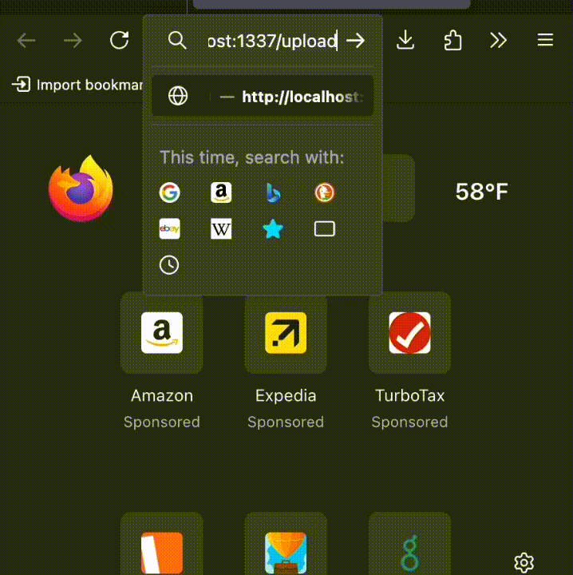

## Flask on docker

### Overview

This repository sets up a Dockerized Flask web application with PostgreSQL, Gunicorn, and Nginx for production-ready deployment. The Flask app handles application logic and interacts with a PostgreSQL database for persistent storage. Gunicorn serves as the WSGI application server to handle concurrent requests, while Nginx acts as a reverse proxy to route traffic and serve static files efficiently.

### Usage

Development mode uses the default Flask development server. Create a .env.dev file in the root folder to store environment variables. Then, build the images and run the containers through
```
$ docker-compose up -d --build
```

Production mode used Gunicorn and Nginx. Create `.env.prod` and `.env.prod.db` files to store environment variables for production, then it could be run by
```
$ docker-compose -f docker-compose.prod.yml up -d --build
```

After building in either mode, access the application at http://localhost:1337 to upload media and retrieve static/media information.

Following is an example:
<div style="display: flex; justify-content: center">

</div>
